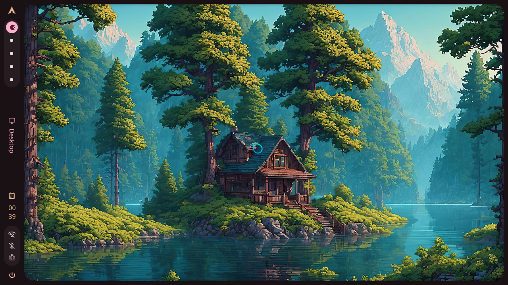
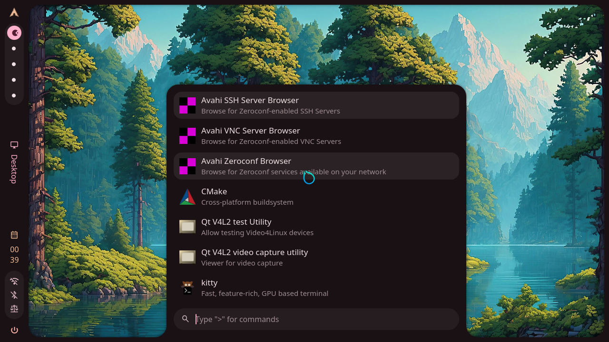
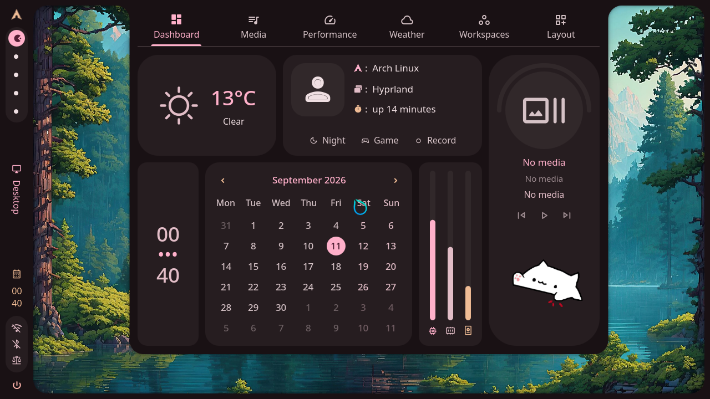
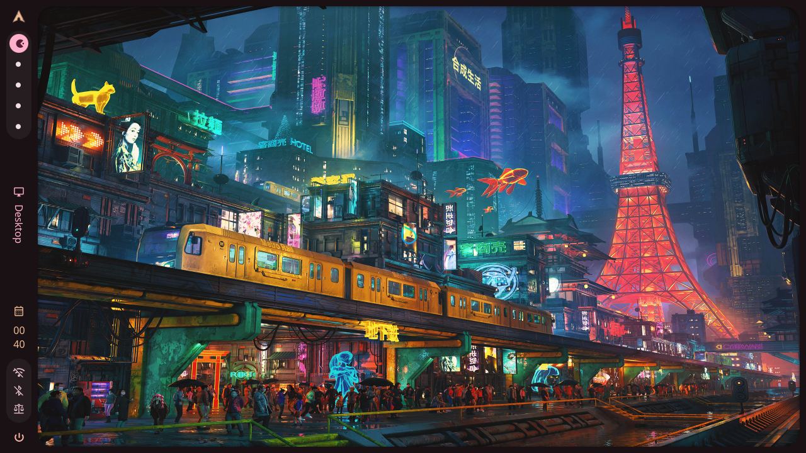
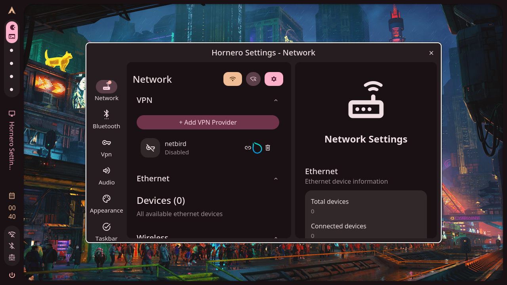

# website

Official website for Hornero OS.

This is the product and marketing surface: what Hornero OS is, what it looks
like, how to download and install it, and how to join the community.
Technical documentation lives separately in
[HorneroOS/docs](https://github.com/HorneroOS/docs).

## Screenshots

Pre-release development snapshots of the Hornero desktop (Hyprland +
Hornero Shell on Arch, captured from the QEMU/KVM graphical test harness at
1280×720 — see [HorneroOS/shell docs/VM_TESTING.md](https://github.com/HorneroOS/shell/blob/main/docs/VM_TESTING.md)):

## Visual direction

The site will eventually emphasize the project's identity: pixel art with an
Argentine inspiration — hornero birds, nests and related concepts — alongside
strong desktop screenshots and clear installation/download flows.

No finalized design system exists yet, and no site stack has been chosen.
The screenshots above are the first real material toward that site.

## Status

Early scaffolding plus the first screenshot set. No website code lives here yet.

## License

[MIT](LICENSE).
